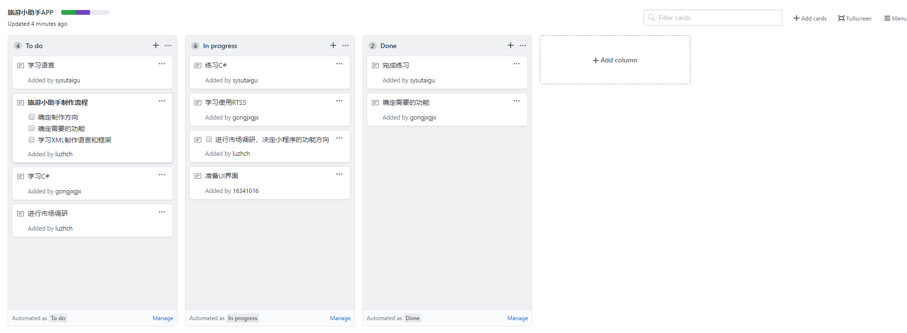
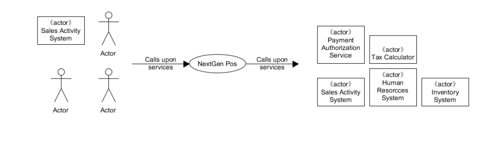

1. 用简短的语言给出对分析、设计的理解

分析(analysis)与设计(design)的区别可以用“做什么 vs. 怎么做”来概括；分析强调的是对问题和需求的调查和研究而不是解决方案，设计强调的是满足需求的概念上的解决方案（在软件和硬件方面）而不是其实现。

2. 用一句话描述面向对象的分析与设计的优势

面向对象的分析与设计（OOAD）强调的是在问题领域内发现和描述对象（概念）并定义软件对象以及它们如何写作以实现需求，从而避免从过程、数据结构等细节上进行复杂的讨论。

3. 简述UML的作用，考试考哪些图

统一建模语言 （Unified Modeling Language，UML）是描述、构造和文档化系统制品的可视化语言，UML的本意是要成为一种标准的统一语言，使得IT专业人员能够进行计算机应用程序的建模。UML不是一种方法学，它不需要任何正式的工作产品（即IBM Rational Unified Process术语中所定义的”工件”）。而且它还提供了多种类型的模型描述图（diagram，当在某种给定的方法学中使用这些图时，它使得开发中的应用程序的更易理解。

- [ ] 用例图
- [ ] 类图
- [ ] 序列图
- [ ] 状态图
- [ ] 活动图
- [ ] 组建图和部署图

4. 从软件本质的角度，解释软件范围控制的可行性

软件的本质特性以及软件需求的易变性所可能带来的潜在的巨大风险意味着完全控制软件范围是一件几乎不可能的事情，但我们必须在一定程度上控制软件范围。 软件分析的目的不是找出所有的需求并完善而是确认有效的功能与需求，去伪存真不断满足客户需要。软件设计也不是追求最先进技术，而是控制变化附加的成本，使得软件生产的预算、时间等能在掌控之中。

# 二、项目管理实践

看板使用练习（提交看板执行结果贴图，建议使用 Git project）

•	使用截图工具（png格式输出），展现你团队的任务 Kanban

•	每个人的任务是明确的。必须一周后可以看到具体结果

•	每个人的任务是1-2项

•	至少包含一个团队活动任务

练习使用UMLet

UML和模式应用  83页

